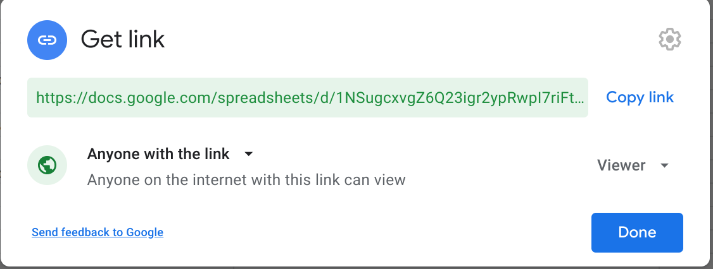

# Collaborative Data Entry and Frontend Development for Humanities Projects Using Google Sheets and Javascript

> M. Willis Monroe (willismonroe@gmail.com)

The purpose of this tutorial is two-fold: first, to create a solution that allows for collaborative well-structured data entry, and second, to provide a framework for creating a website that displays that data in a customizable way hosted for free on the web. This solution embodies a classic paradigm in web development: the separation of concerns between the backend (usually a database) and frontend (the user's interface for viewing/editing the data). These are two aspects of your website that do fundamentally different things and are programmed and designed in very different ways. This tutorial will use [Google Sheets](https://docs.google.com/spreadsheets/) as the backend, allowing a group of scholars (including students) to collaboratively add and edit data to a shared sheet. If and when the project is completed, the data can be fully exported from Google Sheets to avoid being locked in to that platform. By accessing the Google Sheet via a JSON api we can then consume it in a Javascript based frontend. This allows the two parts of the project to remain separate. Data can be entered and remain private until its ready for publication by the frontend. Similarly, the data can be entered in one format and appear in a different configuration on the frontend.

A typical use case might involve a classroom-based project where groups of students are tasked with independent research on topics under a common heading. The entire project will then be represented by a summary website which displays the research of each group. The groups will add their data to their data to the spreadsheet which can be approved by an instructor. 

## Project Setup

The most difficult part of any digital project is the initial step of laying out objectives and designing data collection. For any of the latter steps to work you need well structured data that conforms to a common schema agreed on by all of the participants in the project. The initial design of a spreadsheet (in this case on Google Sheets) involves explicit choices that have long impacts on the life of the project and are hard to correct or amend if decisions need to be changed earlier. That being said, there are early decision that can facilitate later changes in objects and schema that will be discussed below.

A few examples of important decision around recording data:

1. Your data collection might involve entering dates. What standard format will you use to make sure that all dates are comparable? If your dates included years in BCE it is common to transpose those into negative numbers so that sorting methods place them appropriately before years CE. Finally, if you want to included uncertainty in the recording of dates, what standardized system will you use to indicate this (perhaps a second column containing the degree of uncertainty)?

2. Much of the data might take the form of categorical data. What strategies will you use to limit the number of choices to make sure all rows are comparable? How might account for needing to add options later on in the process?

As you can see from just these two examples, there are many decisions that have long last impacts but when considered fully make the data you will collect much more powerful for analysis.

Once you've determined the schema (and coding justifications) considering doing dry runs with collaborators to get a sense of how smoothly the source data fits on to your schema.

When designing the actual spreadsheet you will use for data entry take advantage of the various data validation tools built into Google Sheets to help keep the data clean as its being entered. It's generally a good idea to make column headings lower-case and avoid spaces (use "_" instead). These naming conventions make working with the columns much easier in the frontend.

You might consider adding a few more columns that are not directly related to your data:

1. A "publish" column can be useful, initially set to "0", it can be flipped to "1" by an instructor or TA as each row is checked for completeness. The frontend can filter out rows where "publish" is "0" and not display that data.

2. The name of the coder and date of entry are two more "meta"-columns that can help later on tracking down errors or properly crediting collaborators.

3. Also consider what data is assumed within your dataset and whether making it explicit might facilitate expansion in the future. For instance, you might be cataloging historic sites within your town. It might seem redundant to add the town name as a column, but by doing so you make it trivial to expand to other towns in the future.

With these columns added and the spreadsheet designed you can begin inviting your collaborators to the sheet and divide the work in a way that make sense for those involved.

> For an example of how to structure a spreadsheet for collaborative data entry see the example sheet for this tutorial here: https://docs.google.com/spreadsheets/d/1NSugcxvgZ6Q23igr2ypRwpI7riFtoQruC1YuAHYvB9E/edit?usp=sharing

## Designing the Project

Now that the data is being captured in a highly structured way we can start thinking about how we want the frontend to look and what we want it to do:

- What sort of views would be the best way to summarize your data?
- What highlights do you want to show for each row?
- How much data should the user see at once?

The sky is the limit at this stage, but keep in mind while everything may be possible with advanced knowledge of javascript, this tutorial will keep things simple by presenting a couple of useful ways to extract and display the data.

To begin with you should create a Github account (if you don't already have one) and create a new repository for the project. Your Github username and the repository name will both be included in the URL for the eventual frontend so keep that in mind while choosing both. The Github page will serve as the home for your code but also, as mentioned above, a handly place to coordinate with everyone else on the project via the "Issues" tab:

> The name "issues" is a legacy of Github primarily hosting repositories for programs that might have bugs or other "issues". In reality it's a handy little forum with some nice features. You can write posts in markdown (including usable checkboxes) you can assign posts to users (including yourself) you can tag them with different tags ("data-entry", "feature", "question" etc...). All in all it's a convenient way to keep conversations around the project well organized.

At this point you should review your Javascript fundamentals, we'll be working with Objects, List, string interpolation, and basic HTML modifications in JS. It is worth also brushing up on HTML and CSS although primarily we're going to be using a standard CSS library, PicoCSS, to handle the styling of the website.

> For an example of a typical layout for this type of project see the example site here: https://willismonroe.github.io/ph-meeting-house-example/ in particular have a look at the html layout found in the index.html file: https://github.com/willismonroe/ph-meeting-house-example/blob/main/index.html

## Mocking up the Frontend

Start by creating a simple HTML5 template for your site and giving it a title. It can be useful to choose a simple CSS library for overall style. In my example I am using [PicoCSS](picocss.com). Make sure you add it to the head tag as well. 

Add some basic framing text to introduce the visitor to the project and include the credits for the project (your collaborators, funders, hosting institutions etc...) within the body tag.

At this point you can take some of the ideas you formulated in the previous section about how you want to the data to look and practice mocking those up in HTML:

- For instance you might want to have cards for each row of the sheet: what would a card look like, which columns will go in which fields of the HTML?
- Or perhaps you want paragraphs of text with columns inserted in placeholder locations, mock a few up to see how the data will fit within your vision.

Once you've got an idea for how the site should look, take two rows of data from the sheet and create the raw HTML of the design you want and insert the data from the sheet where you want it to appear. This example data serves as a handy mockup so you can design the generic appearance of each row of the data. Once you've iterated through the design process we're ready to move on to the next step.

The final HTML page should contain all the layout and style of the page as well as the frontmatter. In the location where you want the dynamic data from the spreadsheet to appear, delete your mockup data from before and insert a empty tag: `<div id="insert-here"></div>`.

## Programming the Frontend

The first step is to connect the backend and frontend, to do that we're going to use a handy Javascript snippet that ingests the Google Sheet and turns it into a data structure that we can parse in our Javascript application:

Create a script tag at the bottom of the body of your HTML document. This is going to be where we run all the Javascript that makes the page work.

We'll fill the script tag with two different types of functions, the first type fetches and processes the data into a form that we can use, and the second uses that processed data to create new HTML elements on the page to display it how we want:

```javascript
// This variable will hold all of the data that we fetch from our spreadsheet, it starts as an empty array.
let data = [];
// This variable will hold the id for your spreadsheet to be used later.
const spreadsheetId = "<put your spreadsheet id here>";
// We want to create a new function that fetches the data, this will be called when the page loads. It's asynchronous because fetching takes time.
async function fetchData() {
  // We fetch the data via the json endpoint from Google Sheets and store the response in a temporary variable.
  const res = await fetch(
  `https://docs.google.com/spreadsheets/d/${spreadsheetId}/gviz/tq?tqx=out:json`
  );
  // We turn the response into text.
  const text = await res.text();
  // Finally we slice the beginning off of the text and turn it into JSON.
  return JSON.parse(text.substr(47).slice(0, -2));
}

// Next we need a function that turns the JSON representation of the sheet into our data variable from above.
function parseJSON(json) {
  // We define a variable to hold the column headings.
  let header = [];
  // We iterate over the headings and add them to the header variable.
  for (const value in json.table.cols) {
    header.push(json.table.cols[value].label);
  }
  // Now we iterate over each row of the table (in JSON) and add them to a temporary variable representing a row of the table.
  for (const row in json.table.rows) {
    entry = {};
    for (const [index, col] of header.entries()) {
      // JSON doesn't store the data in a predictable order, so we fetch each column of the row by the index of its header. If it doesn't exist we just record "0".
      entry[col] = json.table.rows[row].c[index]?.v ?? 0;
    }
    // Once we've done that we add that row to the data variable.
    data.push(entry);
  }
}
```

These two functions fetch the data from the Google Sheets JSON api and then convert it into a native Javascript object that we can use later on. While these functions might look complicated they're relatively straight forward.

You'll need to insert your Google Sheets' unique ID into the variable named spreadsheetId. You can find it by going to your Google Sheet and opening the share dialog. Copy the unique ID after `spreadsheets/d/` and before `/edit?usp=sharing` 

Next we need to create the Javascript code that will take this processed data and turn into HTML and insert it into the page. Here is where the design work you did in the previous section will pay off. The general idea is that we want to fetch the data using the functions created above and then for each row in the sheet create a custom HTML element that displays the content on the page.

Start by creating a function that takes one row of data and creates the HTML from the data.

```javascript
// This function takes a single row of the data variable and creates a complete HTML article tag (and child tags) based on the values of each column.          
function createArticle(row) {
  // We started by making a blank string that will hold the HTML that we will add to it in the subsequent lines.
  let html = "";

  // In this case we're going to check if the "standing" column is true or false (1 or 0) and change the message based on that result.
  let standing = "";
  if (row.standing) {
    standing = "standing";
  } else {
    standing = "no longer standing";
  }

  // Here we take the value of the "size" column and stick in a <p>aragraph tag.
  let size = `<p>Size: ${row.size}.</p>`;

  // Similar to "standing" above, if there are any notes we put them into the notes variable, if not, it remains empty.
  let notes = "";
  if (row.notes) {
    notes = `<p>Notes: ${row.notes}</p>`;
  }

  // Same as above, if there's a link it gets added as a footer, otherwise this string is blank (and has no effect).
  let historic_link = "";
  if (row.historic_register) {
    historic_link = `<footer>A online record of this building can be found <a href="${row.historic_register}">here</a>.</footer>`;
  }

  // Using javascript's template literals, we can now slot in each of those variables we created above (and some literal values that we pull from the spreadsheet: date, city, state). We augment these with more html to give the text some additional markup. 
  const article = `
  <article>
    <header>
      <u>${row.date} - ${row.city}, ${row.state}</u> <span style="float: right">${standing}</span>
    </header>
    ${size}
    ${notes}
    ${historic_link}
  </article>
  `;
  // Once that's done we return the article tag as a string to be added to the webpage by another function.
  return article;
  }
}
```

This function takes each row and based on the value of each column assembles a custom HTML `article` tag containing the data. Notice that in a couple of places the code checks to see if any data exists in the column, and omits that part of the output if necessary.

From here we need a very simple function that iterates over the data and assembles all of the sections together:

```javascript
// We need to get the location where we're going to add our custom data, in this case we've give that particular html tag the id of "insert-here".
div = document.getElementById("insert-here");
// This function takes all the rows of the data variable and creates the unique html for each row. 
function renderList(rows) {
  // As before we start with an empty variable holding the html string that we will create.
  html = "";
  // Then we iterate through each row in the data.
  for (const row in rows) {
    // It's important to check if the column "publish" is set to true, if so we can process the row and add its html to the longer list.
    if (rows[row].publish) {
      // If the row is set to publish we create the html and append it to our growing string.
      html += createArticle(rows[row]);
    }
  }

  // Finally, once all rows have been process we add them all to the inside of the div-tag that we identified at the top of the code-block.
  div.innerHTML = html;
}
```

Here we fetch the element that we want to add the custom content to, then we iterate over each of the rows in the data, check if the row is set to publish, call the previous function, and append it to the output. At the end we replace the inner content of the original element.

Finally we need to tie all of this together. At the very bottom of your `script` tag place a call to the `fetchData` function and a `.then()` block once it returns. Inside the `.then()` we'll put all the processing we want to do as the page loads:

```javascript
// This code is not a function or variable definition, this is actually what runs when the page loads, first we fetch the data using the fetchData() function, then once that has been received, we process, and render the data on the page.
fetchData().then((json) => {
  parseJSON(json);
  renderList(data);
});
```

At this point everything should work. If you're editing the page in a program like VSCode you can use the [Live Server Extension](https://marketplace.visualstudio.com/items?itemName=ritwickdey.LiveServer) to see if everything is working.

## Hosting your project

The next step is to host it somewhere; for the purposes of this tutorial we will be using Github as our host. If you've taken the recommendation above to use Github for project management this will be very easy. Login to Github and add your index.html file to it via the `Add file` button. Give the commit a title and description and then click `Commit changes`.

To make the index.html live you need to configure Github Pages, click on the `Settings` button at the top with a gear icon. From there navigate to `Pages` on the left. Under **Source** select `main` and click the `Save` button. You'll now have a URL that will load your `index.html` page (give it a minute or two to get setup) that will always pull the most recent data from your Google Sheet.

From here you can keep editing the `index.html` file locally and uploading, or just edit it right in Github and commit the new changes. As soon as you do the Pages URL will reflect the new version.

## Future-proofing

This tutorial relies on two companies hosting your data and frontend, Google and Microsoft respecitvely. Neither is obliged to keep hosting your project for free indefinitely. It is worth considering ways preserve your data and your project.

The first concern should always be your data. It is worth considering archiving your spreadsheet (exporting in a CSV format) with a repository service provided by your own instution (if you have one) or with a public repository like [Zenodo](zenodo.org).

Your website itself can be archived in a similar manner by uploading the index.html file along with the data. However, it might be worth embedding your spreadsheet into the html so that the index.html file contains both the layout (HTML), code (Javascript), and data in one single file.

To export the data in this format, take the unique URL that your javascript constructs `https://docs.google.com/spreadsheets/d/PUT-SPREADSHEET-ID-HERE/gviz/tq?tqx=out:json` and put that into your browser, download the resulting file. You'll need to edit it a bit, remove all the beginning text up until `{"version` and remove the final `);` at the end of the file. Copy this edited text and paste it into your javascript as a new variable named `spreadsheetJSON`:

```javascript
const spreadsheetJSON = JSON.parse(`{"version":"0.6","reqId":"0","status":"ok","sig":"1426923876","table":{"cols":[{"id":"A","label":"publish","type":"number","pattern":"General"}...)
```

Remove the `fetchData()` function as it's not needed anymore, and finally modify the lines at the very end of the javascript to read:

```javascript
parseJSON(spreadsheetJSON);
renderList(data);
```

This code will instead parse the static output of your spreadsheet rather than pulling a fresh version each time. With that change, the entire project can be distributed via the index.html file which can either be used locally, or hosted by any webserver.

> See the example static version as a [live site](https://willismonroe.github.io/ph-meeting-house-example/index_static.html) and the [source](https://github.com/willismonroe/ph-meeting-house-example/blob/main/index_static.html).